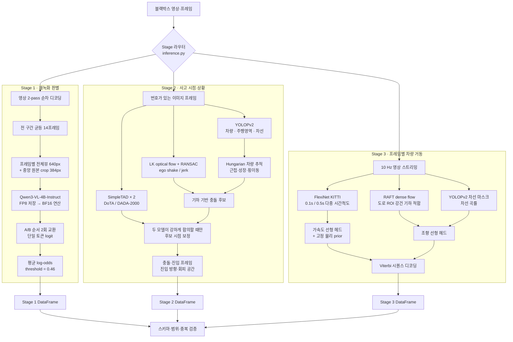

# 멀티모달·시공간 증거 융합 기반 블랙박스 고의사고 분석 AI

행정안전부·한국지능정보사회진흥원이 주최하고 국립과학수사연구원이 주관한 **블랙박스 영상 기반 지능형 고의사고 분석 모델 AI 경진대회**를 위해 개발한 모델입니다. 블랙박스 영상에서 **재녹화 여부**, **사고 시점·상황**, **차량의 가감속·조향**을 함께 추론합니다.

이 저장소는 최종 추론 코드를 공개용으로 정리한 것입니다. 대용량 가중치는 Git에서 제외했으며, 모델의 역할·학습 범위·추론 전략과 선행연구 대비 확장점을 재현 가능한 수준으로 기록합니다.

> **중요:** 이 모델의 출력은 감정관의 판단을 보조하기 위한 범주·시점 추정치입니다. 사고 원인, 고의성, 법적 책임을 판정하지 않습니다.

## 1. 문제 정의와 설계 원칙

대회는 하나의 제출 코드에서 다음 세 결과를 요구합니다.

| Stage | 입력 | 출력 | 이 제출의 핵심 접근 |
|---|---|---|---|
| 1. 재녹화 판별 | 영상 | `ORIGINAL` / `RERECORDED` | Qwen3-VL의 전역 장면 이해와 원본 해상도 중앙부의 국소 재촬영 흔적을 함께 판별 |
| 2. 사고 분석 | 프레임 이미지 묶음 | 충돌·진입 프레임, 회피 공간, 진입 방향 | YOLOPv2 도로 인지 + 차량 추적 + LK 카메라 충격 신호 + 보수적 SimpleTAD 합의 가드 |
| 3. 차량 거동 | 10 Hz 주행 영상 | 프레임별 가감속·조향 범주 | FlexiNet 속도 대용치 + RAFT/도로기하 + 저용량 분류기 + Viterbi 시간 평활화 |

세 가지 문제를 하나의 제한된 오프라인 실행 환경에서 처리하기 위해 다음 원칙을 일관되게 적용했습니다.

- **오프라인·동결 추론:** 평가 중 다운로드, 재학습, 테스트 시점 적응을 하지 않습니다.
- **파일 간 독립성:** 한 영상의 통계·캐시·시간 상태가 다른 영상으로 전달되지 않습니다.
- **문제별 모델 분리:** 한 거대 모델에 모든 결정을 맡기지 않고, 시각 포렌식·도로 기하·시간 동역학에 맞는 모델을 조합합니다.
- **출력 안전장치:** 스키마, 클래스, 정수 프레임, 프레임 순서와 중복을 최상위 진입점에서 검사합니다.

## 2. 전체 아키텍처



Stage 3는 GPL-3.0 구성요소를 독립 프로그램으로 유지하기 위해 `worker.py`를 별도 프로세스로 실행하고 임시 CSV로 결과를 전달합니다. Stage 1/2 인터프리터는 Stage 3 모듈을 직접 import하지 않습니다.

### 학습된 범위와 동결된 범위

| 구성요소 | 원 사전학습/미세조정 | 이 제출에서의 추가 학습 |
|---|---|---|
| Qwen3-VL-4B-Instruct-FP8 | Qwen 공개 checkpoint | 없음; FP8 weight를 BF16으로 복원해 동결 추론 |
| YOLOPv2 | BDD100K 공개 checkpoint | 없음 |
| SimpleTAD × 2 | DoTA / DADA-2000 미세조정 checkpoint | 없음 |
| FlexiNet | KITTI 속도 추정 checkpoint | backbone 추가 학습 없음 |
| RAFT | torchvision `C_T_SKHT_K_V2` checkpoint | 없음 |
| Stage 3 선형 head | 동결 특징을 결합하는 고정 계수 | 평가 중 업데이트 없음 |

배포된 backbone과 head는 모두 추론 전에 고정되며, 이 저장소는 **최종 추론 파이프라인**을 재현합니다.

## 3. Stage 1 — 재녹화 여부 판별

### 3.1 추론 과정

1. 컨테이너의 부정확한 frame count나 seek에 의존하지 않고 영상을 처음부터 끝까지 세어 실제 디코딩 프레임 수를 구합니다.
2. 영상 전 구간에서 최대 **14개 프레임**을 균등 추출합니다.
3. 각 프레임을 두 시점으로 제공합니다.
   - 최대 변 640 px의 **전체 장면**: 화면 테두리, 반사, 촬영 환경 등 전역 단서
   - 원본 해상도의 중앙 **384×384 crop**: 디스플레이 픽셀 격자, moiré 등 미세 단서
4. 동결된 `Qwen3-VL-4B-Instruct-FP8`을 BF16으로 역양자화해, 생성 없이 마지막 토큰의 `A`/`B` logit만 읽습니다.
5. 선택지 의미를 두 번 뒤집어 추론한 뒤 같은 클래스 기준으로 복원한 log-odds를 평균합니다.

두 선택지 순서에서 얻은 재녹화 확률을 각각 `p₁`, `p₂`라 하면 최종 점수는 다음과 같습니다.

```text
score = sigmoid((logit(p₁) + logit(p₂)) / 2)
```

`score >= 0.46`이면 `RERECORDED`로 분류합니다. 14개 시점의 증거를 사용해 영상 일부에만 나타나는 재촬영 흔적도 함께 관찰합니다.

### 3.2 선행연구에서의 확장

재촬영 포렌식 연구는 moiré, 색·질감 통계, aliasing, 조명 불일치, 경계 흐림 같은 흔적을 활용해 왔습니다. 특히 Li et al.은 CNN의 국소 특징과 ViT의 전역 특징을 결합했습니다. 이 제출은 별도의 재촬영 탐지기를 학습하는 대신 다음처럼 확장했습니다.

- **국소/전역 결합을 입력 표현으로 구현:** 전체뷰와 원본 해상도 crop을 동시에 사용합니다.
- **정지 이미지 탐지에서 영상 단위 판정으로 확장:** 14개 균등 시점의 증거를 한 번에 결합합니다.
- **멀티모달 사전학습 활용:** Qwen3-VL의 multi-image 공간·시간 추론 능력을 고정 특징 판별기로 사용합니다.
- **선택지 편향 완화:** VLM/LLM의 option token·위치 편향 연구를 반영해 양쪽 선택지 순서를 모두 평가하고 log-odds 공간에서 결합합니다.
- **보수적 프롬프트:** JPEG, resize, motion blur, 블랙박스 오버레이만으로 재녹화라고 판단하지 않도록 구체적으로 제한합니다.

추가 미세조정은 하지 않았습니다. 따라서 0.46은 확률 보정값이 아니라 제출 전략상 고정 decision threshold입니다.

## 4. Stage 2 — 사고 주요 시점·상황 분석

### 4.1 다중 작업 도로 인지

YOLOPv2의 한 번의 forward pass에서 다음 세 표현을 얻습니다.

- 차량 후보 박스: COCO vehicle class, confidence threshold와 NMS 적용
- 주행 가능 영역 마스크
- 차선 마스크

차선은 Hough line으로 좌·우 경계를 적합하고, 양쪽 경계가 모두 관측되지 않으면 명시적인 원근 corridor prior를 사용합니다. 이로써 객체 위치를 단순 화면 좌표가 아니라 ego lane에 대한 상대 위치로 변환합니다.

### 4.2 충돌 시점

충돌 후보는 하나의 신호가 아니라 다음 증거를 결합합니다.

- pyramidal Lucas–Kanade forward/backward flow
- RANSAC 전역 affine motion에서 얻은 translation·rotation·scale 변화
- 시간 미분한 jerk와 회전 충격
- 차량 박스의 화면 하단 근접도, 크기 증가, 횡이동
- 컷 전환 억제 규칙

최대 720개 motion frame과 180개 perception frame으로 1차 탐색한 뒤, 긴 영상은 후보 주변 원본 프레임을 다시 디코딩해 국소 시점을 복원합니다. 충격 peak 자체보다 연결된 burst의 시작점을 선택해 hood/body rebound로 인한 늦은 예측을 줄입니다.

### 4.3 SimpleTAD는 ‘결정기’가 아닌 ‘불일치 가드’

DoTA와 DADA-2000으로 각각 미세조정된 두 SimpleTAD Video ViT를 사용하지만, anomaly onset을 곧바로 물리적 접촉 시점으로 간주하지 않습니다.

기하 기반 후보를 바꾸는 조건은 모두 충족되어야 합니다.

1. 두 모델 모두 기존 후보의 anomaly 확률을 낮게 평가
2. 두 모델 모두 강한 대안 onset을 제시
3. 대안 peak 간 차이가 3프레임 이내
4. 원본/좌우 반전 영상의 평균 결과에서도 유지

즉, SimpleTAD가 사고 시점을 전면 대체하는 것이 아니라 **서로 다른 도메인의 두 동결 모델이 강하게 합의할 때만 기하 추정을 교정**합니다.

### 4.4 진입·방향·회피 공간

- **진입 방향:** 사고 차량 track 초기 위치를 차선 중심과 비교하고, 애매하면 횡방향 이동 부호를 사용합니다.
- **진입 프레임:** 박스 중심보다 빠른 ‘가까운 박스 경계’가 ego-lane 경계를 연속으로 넘는 시점을 보간합니다.
- **회피 공간:** 충돌 주변 3개 시점의 좌·우 인접 corridor에서 주행 가능 영역과 차량 점유를 함께 측정하고 과반수로 결정합니다.

YOLOPv2가 제안한 객체·주행영역·차선의 multi-task perception을 사고 기하로 확장했고, SimpleTAD의 효율적인 encoder-only anomaly score는 **contact detector가 아닌 보수적 반증 신호**로 재해석했습니다.

## 5. Stage 3 — 차량 가감속·조향 분류

### 5.1 특징 추출

모든 예측은 대회 입력의 0.1초 단위 프레임에 대해 생성합니다.

**가감속 경로**

- FlexiNet KITTI checkpoint에 64×64 grayscale 13프레임 window를 입력합니다.
- 0.1초 간격(`raw1`)과 0.5초 간격(`raw5`)의 두 시간척도를 사용합니다.
- 속도 대용치와 1.5초/3초 smoothing derivative, 상대 가속도, motion fit 품질, 곡률·잡음을 6차원 특징으로 구성합니다.
- 선형 분류기 확률과 고정된 물리 규칙의 `STOPPED`/가감속 확률을 50:50으로 혼합합니다.

FlexiNet 출력은 이 데이터에서 보정된 실제 m/s가 아니라 **단안 영상 motion proxy**로만 사용합니다.

**조향 경로**

- RAFT dense flow를 도로 ROI에 제한합니다.
- pinhole road-plane motion basis를 robust iteratively reweighted least squares로 적합해 yaw/전진 운동·잔차를 얻습니다.
- YOLOPv2 차선 마스크에서 양쪽 차선 곡률과 신뢰도를 얻습니다.
- yaw, 차선 곡률, 속도 대용치, motion 품질을 선형 조향 헤드에 입력합니다.

두 경로 모두 원본과 좌우 반전 view를 평균합니다. 반전 시 좌/우 부호를 명시적으로 되돌려 대칭 제약을 유지합니다. 마지막으로 Viterbi decoding을 사용해 프레임 간 불필요한 label flicker를 줄입니다.

### 5.2 결합 전략

대형 backbone과 `motion_v2_head.json`의 저용량 선형 head는 추론 전에 모두 고정합니다. 가감속·조향의 물리적 대칭을 반영하고, `STOPPED` prior와 프레임 간 전이 비용을 함께 사용합니다. 평가 중에는 어떤 파라미터도 갱신하지 않습니다.

FlexiNet의 단안 속도 추정, RAFT의 dense optical flow, YOLOPv2 차선 인지를 그대로 최종 클래스로 사용하지 않고, 서로 보완적인 motion evidence로 결합해 대회 범주에 맞게 확장했습니다. 저용량 head와 물리·대칭 제약을 함께 사용하는 것이 핵심입니다.

## 6. 선행연구와 본 제출의 관계

| 선행 방법 | 원 연구의 핵심 | 본 제출에서의 확장·적용 |
|---|---|---|
| LCD 재촬영 포렌식 ([Thongkamwitoon et al., 2017](https://doi.org/10.1016/j.diin.2017.10.001); [Li et al., 2023](https://doi.org/10.1016/j.jvcir.2022.103692)) | 재촬영 과정의 통계·미세 moiré와 국소/전역 특징 결합 | 전체뷰+원본 crop, 14개 시점으로 영상 전체 증거를 Qwen3-VL에 결합 |
| [Qwen3-VL](https://arxiv.org/abs/2511.21631) | interleaved multimodal context, 공간·시간 추론 | 생성 모델을 동결한 A/B logit classifier로 제한해 오프라인·결정론적 판별에 사용 |
| MCQA selection bias ([Zheng et al., 2024](https://aclanthology.org/2024.findings-naacl.130/); [Atabuzzaman et al., 2025](https://aclanthology.org/2025.emnlp-main.1703.pdf)) | option token과 위치 순서가 응답을 바꿀 수 있음 | 선택지 순서를 뒤집어 두 번 추론하고 같은 클래스의 log-odds를 평균 |
| [YOLOPv2](https://arxiv.org/abs/2208.11434) | 객체·주행영역·차선을 동시에 추론 | 세 출력을 ego-lane 좌표, 차량 track, 회피 corridor로 변환 |
| [Lucas–Kanade](https://publications.ri.cmu.edu/storage/publications/pub_files/pub3/lucas_bruce_d_1981_1/lucas_bruce_d_1981_1.pdf) | 영상 정합을 통한 국소 motion 추정 | forward/backward 검증 + RANSAC affine jerk로 충격 신호를 만들고 object proximity와 결합 |
| [SimpleTAD](https://arxiv.org/abs/2507.09338) | 단순한 Video ViT encoder로 효율적 교통 이상 탐지 | DoTA/DADA 두 모델의 강한 합의만 접촉 후보 보정에 사용하여 anomaly/contact 차이를 보수적으로 처리 |
| [FlexiNet](https://doi.org/10.1109/ACCESS.2025.3562229) | monocular ego-speed 추정의 spatial/temporal 특징 합성 | metric speed가 아닌 다중 시간척도 motion proxy로 사용하고 대칭 선형 헤드와 물리 prior를 결합 |
| [RAFT](https://www.ecva.net/papers/eccv_2020/papers_ECCV/html/3526_ECCV_2020_paper.php) | all-pairs correlation과 반복 갱신을 이용한 dense optical flow | 도로 ROI에만 적용하고 강건한 road-plane motion fitting을 거쳐 yaw/조향 특징으로 축약 |
| [Viterbi, 1967](https://doi.org/10.1109/TIT.1967.1054010) | 전이 비용을 포함한 최적 상태열 디코딩 | 독립 프레임 확률 위에 고정 전이 penalty를 적용해 label flicker 억제 |

이 조합은 새로운 end-to-end foundation model을 학습한 것이 아니라, **서로 다른 사전학습 표현을 고정하고 대회 정의에 맞는 기하·시간 제약으로 연결한 시스템 설계**입니다.

## 7. 저장소 구조

```text
.
├── inference.py                 # 세 Stage 진입점, 출력 검증
├── requirements.txt             # 평가 서버 기본 패키지 메모
├── weights.manifest.json        # Git에서 제외한 가중치의 출처·경로·SHA-256
├── scripts/
│   └── verify_weights.py        # 가중치 존재 여부와 해시 확인
└── model/
    ├── mllm.py                  # Qwen FP8→BF16, A/B 순서 앙상블
    ├── mllm_weights/            # Qwen 설정·토크나이저·라이선스(가중치 제외)
    ├── stage1/                  # 재녹화 영상 샘플링/분류
    ├── stage2/                  # YOLOPv2 + 기하 + SimpleTAD guard
    ├── stage3/                  # 독립 GPL motion 프로그램
    ├── pipeline.json            # Stage별 구성 요약
    └── strategy.md              # 최종 추론 전략
```

## 8. 설치와 가중치 배치

### 8.1 환경

대회 평가 환경과 맞춘 주요 버전은 다음과 같습니다.

```text
Python 3
torch 2.8.0+cu128 / torchvision 0.23.0+cu128
transformers 4.57.6 / safetensors 0.6.2
numpy 1.26.4 / pandas 2.2.2 / scipy 1.15.3
opencv-python-headless 4.10.0.84 / Pillow 10.4.0
```

`requirements.txt`는 대회 서버에 이미 설치된 패키지를 다시 설치하지 않도록 주석으로만 유지했습니다. 별도 환경에서는 위 버전을 직접 준비해야 합니다.

### 8.2 가중치

GitHub 일반 저장소에는 수 GB 체크포인트를 넣지 않습니다. 원 제출 ZIP에서 가중치만 복원하려면 저장소 루트에서 실행합니다.

```bash
unzip /path/to/source_bundle.zip \
  'model/mllm_weights/*.safetensors' \
  'model/stage2/*.pth' 'model/stage2/*.pt' \
  'model/stage3/*.pth'

python scripts/verify_weights.py
```

정확한 경로, 원 출처, revision과 SHA-256은 [`weights.manifest.json`](weights.manifest.json)에 있습니다. 공개 저장소에 가중치를 재배포하기 전에는 각 구성요소의 라이선스와 호스팅 제한을 별도로 확인해야 합니다.

## 9. 추론 인터페이스

평가 실행 환경은 `inference.py`의 세 함수를 호출합니다.

```python
from inference import predict_stage1, predict_stage2, predict_stage3

stage1 = predict_stage1("/path/to/stage1", "./model")
stage2 = predict_stage2("/path/to/stage2", "./model")
stage3 = predict_stage3("/path/to/stage3", "./model")
```

입력 폴더는 다음 형태를 지원합니다.

```text
data/
├── stage1/videos/*.mp4
├── stage2/images/<ID>/*_<frame_number>.jpg
└── stage3/videos/*.mp4
```

반환 컬럼은 다음과 같습니다.

| 함수 | 반환 컬럼 |
|---|---|
| `predict_stage1` | `ID`, `answer` |
| `predict_stage2` | `ID`, `collision_frame`, `entry_frame`, `evasion_space`, `entry_side` |
| `predict_stage3` | `ID`, `sample_index`, `accel_label`, `steer_label` |

`inference.py`는 빈 ID, NaN, 허용되지 않은 class, 음수·비정수 프레임, 중복 key, `entry_frame > collision_frame`, 불연속 Stage 3 sample index를 명시적으로 거부합니다.

## 10. 재현성과 제한사항

- 모든 checkpoint는 `eval()`·`requires_grad_(False)`로 고정되며 `torch.inference_mode()`에서 실행됩니다.
- Hugging Face와 Transformers offline mode를 강제하고 remote code를 신뢰하지 않습니다.
- Stage 1의 두 선택지 점수는 calibrated probability가 아닙니다.
- 중앙 crop은 화면 중심의 미세 패턴에는 유리하지만, 화면 경계 밖의 recapture cue를 놓칠 수 있습니다.
- Stage 2 anomaly onset은 물리적 접촉과 다를 수 있어 가드를 매우 보수적으로 사용하지만 오보정 가능성은 남습니다.
- Stage 2의 차선 prior와 회피 corridor는 카메라 보정값이 없는 근사 기하입니다. ‘회피 가능성’이나 안전을 증명하지 않습니다.
- Stage 3의 단안 속도 대용치는 실제 계기 속도가 아니며, 카메라 장착 높이·노면·날씨·프레임 손상에 민감할 수 있습니다.
- 공개용 저장소는 가중치를 제외하므로 `verify_weights.py`가 통과하기 전에는 end-to-end 추론할 수 없습니다.

## 11. 라이선스와 출처

이 저장소 전체에 하나의 포괄 라이선스를 새로 부여하지 않았습니다. 구성요소별 조건이 다르므로 재사용자는 각 파일의 고지문을 확인해야 합니다.

- Qwen3-VL weights/config: Apache-2.0
- YOLOPv2: MIT
- SimpleTAD 및 해당 checkpoint: CC-BY-NC-4.0
- RAFT/torchvision: BSD-3-Clause 계열 고지
- FlexiNet 및 Stage 3 파생 프로그램: GPL-3.0-only

자세한 attribution, 원 revision과 수정 범위는 [`model/THIRD_PARTY_NOTICES.md`](model/THIRD_PARTY_NOTICES.md), 각 Stage의 `LICENSE*`/`NOTICE*`, [`model/mllm_weights/ATTRIBUTION.md`](model/mllm_weights/ATTRIBUTION.md)를 참고하세요. 특히 SimpleTAD의 **비상업적 사용 제한**과 Stage 3의 **GPL 의무**는 저장소를 재배포하거나 서비스에 사용할 때 반드시 별도로 검토해야 합니다.

## 12. 참고문헌

1. Bai et al., “Qwen3-VL Technical Report,” arXiv:2511.21631, 2025.
2. Li et al., “Recaptured Screen Image Identification Based on Vision Transformer,” *Journal of Visual Communication and Image Representation*, 2023.
3. Zheng et al., “Large Language Models Sensitivity to the Order of Options in Multiple-Choice Questions,” *Findings of NAACL*, 2024.
4. Atabuzzaman et al., “Benchmarking and Mitigating MCQA Selection Bias of Large Vision-Language Models,” *EMNLP*, 2025.
5. Han et al., “YOLOPv2: Better, Faster, Stronger for Panoptic Driving Perception,” arXiv:2208.11434, 2022.
6. Lucas and Kanade, “An Iterative Image Registration Technique with an Application to Stereo Vision,” *IJCAI*, 1981.
7. Orlova et al., “Simplifying Traffic Anomaly Detection with Video Foundation Models,” *ICCV Workshops*, 2025.
8. Teed and Deng, “RAFT: Recurrent All-Pairs Field Transforms for Optical Flow,” *ECCV*, 2020.
9. Ibrahim et al., “FlexiNet: An Adaptive Feature Synthesis Network for Real-Time Ego Vehicle Speed Estimation,” *IEEE Access*, 2025.
10. Viterbi, “Error Bounds for Convolutional Codes and an Asymptotically Optimum Decoding Algorithm,” *IEEE Transactions on Information Theory*, 1967.
